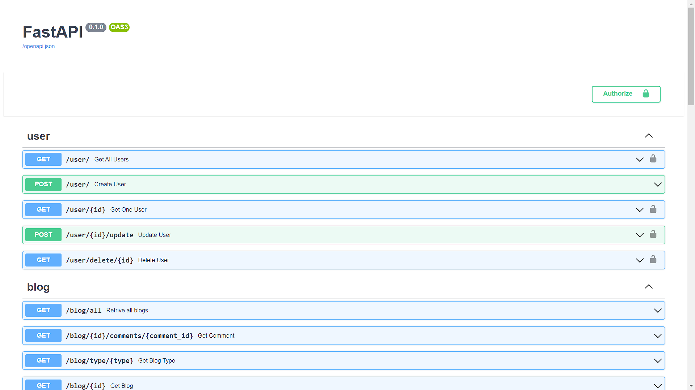

# Nome do seu Projeto
> Um resumo curto sobre o que o seu projeto faz (uma, duas linhas)

Um ou dois parágrafos sobre o seu projeto e o que le faz.



## Instalação

Mac OS X & LINUX 

```
npm install --save
```

Windows:

```
edit autoexec.bat
```

# Exemplo de uso 

Alguns exemplos que motivariam as pessoas a utilizarem seu projeto ou que demonstrasse que este é util para algumas coisas. Divida esta parte em partes menores e se possível coloque alguns códigos ou prints de telas.

## Ambiente de desenvolvimento

Descrever como instalar e preparar qualquer dependência de desenvolvimento para que seu projeto possa ser executado localmente e pessoas possam contribuir com o mesmo. Se possivel forneça as informações para diferentes plataformas. Exemplo: Windows, linux ou Mac OS.

## Historico de Atualizações

* 0.2.1
    * CHANGE: Atualização dos docs (o codigo não foi alterado)
* 0.2.0
    * CHANGE: Removida a função 
    `setPadrãoXYZ()`
    * ADD: Adicionado a função `inicializar()`
* 0.1.1
    * FIX: Crash quando executava `escrever()` (Obrigado ao Contribuidor @Contribuidor)
* 0.1.0
    * Primeiro lançamento estável
    * CHANGE: Renomeado de `Projeto XYZ` para `Projeto ABC`
* 0.0.1
    * Projeto Inicial

# Metainformações

Seu nome - [Seu Twitter](http://www.twitter.com) - seuemail@seuemail.com
Distribuido sobre a lincença . Veja `LICENÇA` para mais informações.
[https://github.com/seuusuario](https://github.com/seuusuario)